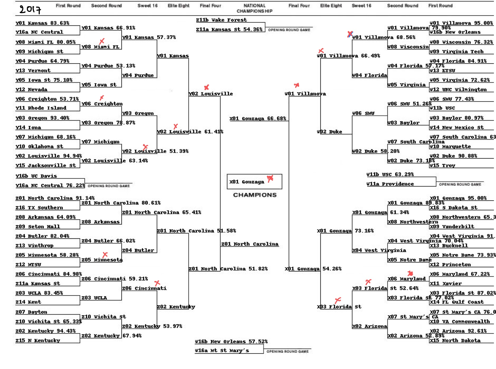

# marchmadness
Kaggle March Madness Competition - 2017 &amp; 2019

- This project presents a classical machine learning approach to predicting the NCAA Men’s Basketball Tournament. The project provides a good exposure to feature extraction and feature selection. We found that the most challenging part of the project is extracting and selecting the best features that will help in predicting the correct outcomes of the matches.
- In this work, we performed extensive feature extraction, feature selection and model selection to predict the outcome of march madness games . We confirmed that the simple logistic regression predicts the best outcomes with log loss of 0.48538.
- For the 2017 bracket, we correctly predicted ​49/63 matches​. 

- For the 2019 bracket, we correctly predicted ​46/63 matches​.

